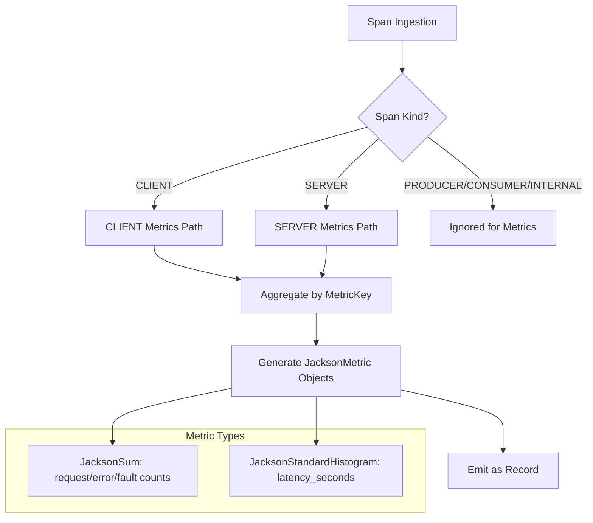

# APM Service Map Metrics Generation Algorithm

## Overview

This document describes how OpenTelemetry APM Service Map Processor generates time-series metrics from trace spans. The processor creates service-level performance metrics (latency, throughput, error rates) from CLIENT and SERVER span relationships.

## Current Architecture

### Windowed Processing Model

```
Window N-1        Window N         Window N+1
[Completed]    [Processing]      [Collecting]
     │              │                 │
     └─→ Emit ──────┴─→ Aggregate ───┘
        Metrics        Spans
```

**Window Lifecycle:**
1. **Collection Phase**: Spans accumulate in current window (default: 3 minutes)
2. **Processing Phase**: Window rotation triggers metric generation
3. **Emission Phase**: Aggregated metrics emitted as batch before NodeOperationDetail events

### Metrics Generation Flow



## Span-to-Metrics Conversion

### 1. CLIENT Span Metrics

**Generated When:**
- Span kind = `SPAN_KIND_CLIENT`
- Has valid parent server operation name (from decoration)
- Remote service ≠ "unknown"

**Metric Labels:**
```yaml
namespace: "span_derived"
environment: <client_span_environment>
service: <client_span_service>
operation: <parent_server_operation_name>  # Key: Uses decorated parent info
remoteEnvironment: <remote_service_environment>
remoteService: <remote_service_name>
remoteOperation: <remote_operation_name>
# Plus all configured groupByAttributes
```

**Purpose:** Captures outbound call performance from caller's perspective

### 2. SERVER Span Metrics

**Generated When:**
- Span kind = `SPAN_KIND_SERVER`
- Generated for ALL server spans (leaf and non-leaf)

**Metric Labels:**
```yaml
namespace: "span_derived"
environment: <server_span_environment>
service: <server_span_service>
operation: <server_span_operation>
# Plus all configured groupByAttributes
```

**Purpose:** Captures inbound request performance from service's perspective

### 3. Missing: PRODUCER/CONSUMER/INTERNAL Spans

Currently **completely ignored** for metrics generation:
- `SPAN_KIND_PRODUCER` (4) - Message publishing
- `SPAN_KIND_CONSUMER` (5) - Message consumption
- `SPAN_KIND_INTERNAL` (1) - Internal operations

## Aggregation Process

### In-Memory State Management

**MetricAggregationState per MetricKey:**
```java
class MetricAggregationState {
    long requestCount = 0;           // Incremented for every span
    long errorCount = 0;             // HTTP 4xx responses
    long faultCount = 0;             // HTTP 5xx responses or ERROR status
    List<Exemplar> errorExemplars;   // Max 10 trace samples
    List<Exemplar> faultExemplars;   // Max 10 trace samples
    List<Double> latencyDurations;   // Raw durations in seconds
}
```

**MetricKey Structure:**
```java
class MetricKey {
    Map<String, Object> attributes;  // Service labels + groupByAttributes
    Instant timestamp;               // Window boundary timestamp
}
```

### Derived Values Computation

**Preprocessing (OTelSpanDerivationUtil):**
- **Error/Fault Logic:**
  - HTTP 5xx → `fault=1, error=0`
  - HTTP 4xx → `error=1, fault=0`
  - Span status ERROR → `fault=1`
  - Otherwise → `error=0, fault=0`

- **Operation Name:**
  - HTTP-aware: `{HTTP_METHOD} {FIRST_PATH_SECTION}`
  - Fallback: span name

- **Environment:**
  - From: `resource.attributes.deployment.environment.name`
  - Default: `"generic:default"`

## Metric Types Generated

### 1. JacksonSum Metrics (Counters)

**Configuration:**
- **Monotonic**: `true` (always increasing)
- **Unit**: `"1"` (dimensionless count)
- **Aggregation Temporality**: `DELTA` (reset per window)

**Metrics Generated:**
```yaml
request:  # Always generated
  value: <requestCount>
  exemplars: []

error:    # Only if errorCount > 0
  value: <errorCount>
  exemplars: <errorExemplars>

fault:    # Only if faultCount > 0
  value: <faultCount>
  exemplars: <faultExemplars>
```

### 2. JacksonStandardHistogram Metrics

**Configuration:**
- **Unit**: `"s"` (seconds)
- **Aggregation Temporality**: `DELTA`
- **Explicit Bounds**: `[0.0, 0.005, 0.01, 0.025, 0.05, 0.075, 0.1, 0.25, 0.5, 0.75, 1.0, 2.5, 5.0, 7.5, 10.0]`

**Generated When:** `latencyDurations.size() > 0`

**Metrics Generated:**
```yaml
latency_seconds:
  count: <number_of_durations>
  sum: <total_duration_seconds>
  buckets: <histogram_buckets_with_counts>
  exemplars: <latency_exemplars>
```

## Processing Timeline

### Window Rotation Sequence

```
1. CyclicBarrier.await() - Synchronize processor threads
2. Collect spans from completed window
3. Decorate spans with ephemeral relationship data
4. Generate CLIENT & SERVER metrics simultaneously
5. Aggregate metrics by MetricKey
6. Create JacksonMetric objects
7. Emit metrics batch (sorted by timestamp)
8. Emit NodeOperationDetail events
9. Clear window state
```

### Multi-Threading Coordination

- **CyclicBarrier**: Ensures all processor threads complete window before rotation
- **Thread-Safe Aggregation**: Single-threaded per window (barrier ensures no contention)
- **Stateless Between Windows**: All metric state cleared after emission

## Example Metrics Output

### CLIENT Span Metric Example
```json
{
  "kind": "sum",
  "name": "request",
  "unit": "1",
  "isMonotonic": true,
  "aggregationTemporality": "AGGREGATION_TEMPORALITY_DELTA",
  "attributes": {
    "namespace": "span_derived",
    "environment": "production",
    "service": "user-service",
    "operation": "authenticate",
    "remoteEnvironment": "production",
    "remoteService": "auth-service",
    "remoteOperation": "validate_token",
    "service.version": "1.2.3"
  },
  "value": 1247,
  "startTime": "2023-12-01T12:00:00Z",
  "time": "2023-12-01T12:00:00Z"
}
```

### SERVER Span Latency Histogram
```json
{
  "kind": "standardHistogram",
  "name": "latency_seconds",
  "unit": "s",
  "aggregationTemporality": "AGGREGATION_TEMPORALITY_DELTA",
  "attributes": {
    "namespace": "span_derived",
    "environment": "production",
    "service": "auth-service",
    "operation": "validate_token"
  },
  "count": 1247,
  "sum": 124.7,
  "buckets": [
    {"boundary": 0.0, "count": 0},
    {"boundary": 0.005, "count": 12},
    {"boundary": 0.01, "count": 89},
    {"boundary": 0.025, "count": 456},
    {"boundary": 0.05, "count": 234},
    // ... more buckets
  ],
  "startTime": "2023-12-01T12:00:00Z",
  "time": "2023-12-01T12:00:00Z"
}
```

## Architecture Gaps

### Missing Async Patterns

**Currently Not Supported:**
```yaml
# PRODUCER metrics missing:
- Message publish rate
- Publish latency
- Publish error/fault rates
- Queue/topic throughput

# CONSUMER metrics missing:
- Message processing rate
- End-to-end processing latency
- Consumer lag metrics
- Processing error rates

# INTERNAL metrics missing:
- Internal operation latency
- Business logic performance
- Internal error rates
```

**Impact:**
- **Event-driven architectures**: No visibility into async message flows
- **Modern microservices**: Missing key performance indicators for queues/topics
- **Service internals**: No breakdown of complex business logic performance

### Required Extensions

To support complete observability, the algorithm needs:

1. **PRODUCER→CONSUMER Relationship Detection**
2. **Async Latency Calculation** (publish-to-consume timing)
3. **Queue/Topic Performance Metrics**
4. **Internal Operation Breakdown**
5. **End-to-End Transaction Tracing**

## File References

**Core Implementation:**
- `ApmServiceMapMetricsUtil.java` - Main metrics generation logic
- `MetricAggregationState.java` - In-memory aggregation state
- `MetricKey.java` - Metric grouping and labeling
- `OTelApmServiceMapProcessor.java` - Orchestration and window management

**Supporting Classes:**
- `OTelSpanDerivationUtil.java` - Span preprocessing and derived values
- `HistogramBuckets.java` - Histogram bucket management
- `SpanStateData.java` - Span state with computed attributes